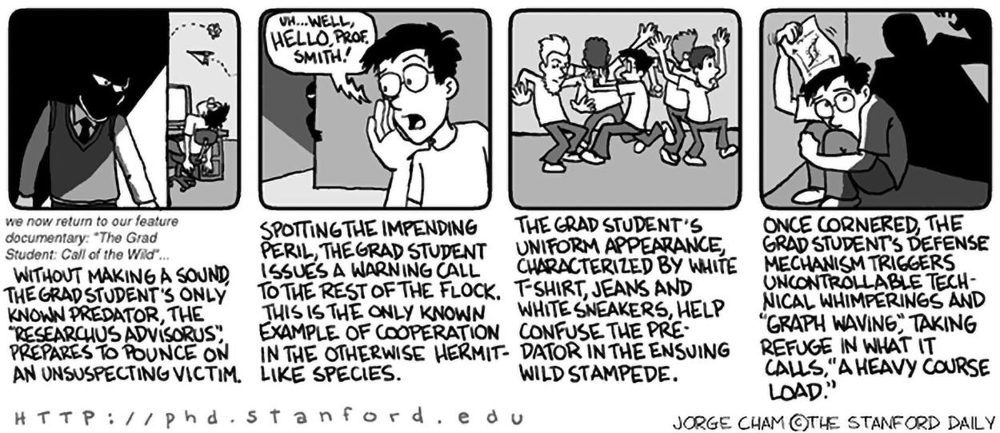

    

I am currently a Ph.D. student in [Beijing International Center for Mathematical Research(BICMR)](https://bicmr.pku.edu.cn/), Peking University, advised by [Guo Chuan Thiang](http://faculty.bicmr.pku.edu.cn/~guochuanthiang/).

I obtained my Bachelor's degree in Mathematics and Applied Mathematics from [School of Mathematical Science](http://english.math.pku.edu.cn/), Peking University in 2024.

## Interests

My research interests lies in **Mathematical Physics**, especially in **Morse Theory** and **Index Theory**. I am interested in describing topology of manifolds using tools from analysis and geometry. Recently, I am learning Atiyah-Singer index theorem and [Carey-Pincus theory](https://link.springer.com/chapter/10.1007/978-3-0348-0411-0_16); I am also interested in geometric formulation of theories of physics -- though I am not quite good at physics.

Most of my leisure time is spent on bed or in the chair: sleeping, gaming, and sometimes writing (or typing, considering that I write with a computer). Some of the things that I wrote are posted on my blog (some of them are in Chinese). I prefer indie games with any of following ingredients: story-rich, puzzles, atmospheric, anti-utopia, and meta -- for example, *Rusty Lake* series, *Superliminal*, *Not for Broadcast* and *MiSide*(not played yet). I also enjoy some AAA games like *Metro* series, *Resident Evil IV*.
