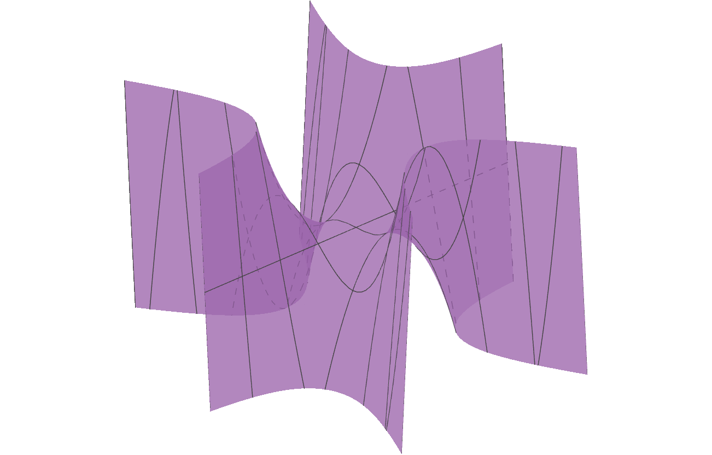

这篇笔记是对Cassidy Curtis的一个构造的解释。他的构造给出了环面上一个仅有三个临界点的函数，并且将它实现为了某个高度函数。他的办法如下图所示

相关的更详细讨论可以参考Banchoff的文章[Height functions on surfaces with three critical values](https://doi.org/10.2969/JMSJ/06310153)以及Curtis的[网站](http://otherthings.com/uw/torus.html).

在Curtis的构造中，最关键的一步是IV. IV之外的部分只是在解释如何对两个半球做形变，使得它们能粘贴到IV的上方和下方。我们下面只解释IV的构造思路。

这一构造一定程度上来自于Morse理论：粗略来讲，在Morse理论中，如果一个闭曲面上的函数的临界点只有极值点和鞍点，那它的临界点和临界点之间的关系可以由闭曲面的拓扑性质（具体而言，同调群和上同调群）来刻画。而在适当的推广下，哪怕函数有鞍点之外的临界点，它也可能转化为鞍点，比如一个形如[猴鞍面](https://en.wikipedia.org/wiki/Monkey_saddle)的临界点可以看作两个靠得非常近的鞍点。这使得我们可以“唯一地”合并鞍点，使得曲面上的临界个数减少到3. 我们最终想要实现的效果是：

$$
T^{2} = S^{2}_{+} \sqcup \Sigma \sqcup S^{2}_{-}.
$$

其中$$S^{2}_{\pm}$$是上、下半球面，$$\Sigma$$有上、下两个同胚于$$S^{1}$$的边界，且包含一个猴鞍。

我们直接取一个猴鞍面$$z=x^{3}-3xy^{2}$$，取它落在圆柱$$\vert z\vert \leqslant 1,x^{2}+y^{2}\leqslant 4$$的部分，如下图所示

这时得到的曲面和IV的最中心部分是一样的，我们唯一要做的事情是，将位于$$x^{2}+y^{2}=2$$上的六条边两两一组粘起来，使得粘贴后，曲面上方的三条边被粘成一个$$S^{1}$$，下方的三条边粘成另一个$$S^{1}$$. 这样的粘贴方式几乎是唯一的：我们将$$x^{2}+y^{2}=4$$上相对的边粘起来（这一粘贴过程用俯视图可以很快画出来）。粘贴完成之后，我们就得到了Curtis的图片中的IV.

可以验证，粘出来的IV是可定向的，我们再粘上两个半球的话，得到的曲面仍然是可定向的。此外计算欧拉示性数不难发现，我们最终得到的曲面的确是环面$$T^{2}$$.

## 一点推广

我们可以考虑其他类型的临界点，比如由柱坐标方程

$$
z=r^{n}\cos(n\theta), \quad n \geqslant 2
$$

给出的临界点。和上面类似，我们也可以粘出某个曲面，并得到上面的仅有三个临界点的函数。我们这里直接给出结果：

* 在$$n=2g+1$$为奇数时，得到的是亏格为$$g$$的可定向闭曲面上的函数
* 在$$n=2k$$为偶数时，得到的是亏格为$$n-1$$的不可定向闭曲面上的函数
